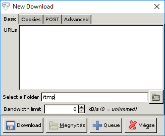

## Features

* invocation
	* single instance (per DBus sessions)
	* accept all __wget command line options__
	* popup <kbd>New Download</kbd> dialog when command line arguments given
* main interface
	* group actions: start, pause, clear
	* columns
		* Name – output file's name, or the filename part of the URL if output is not yet available
		* Progress – percetange
		* Status – Queued, Init, Downloading, Saved, Failed, Paused, Renaming
		* Added – when you added the current download
		* Speed in kB/s, ETA
		* last line of log
	* open
		* downloaded file (with [`mimeopen-gui`](https://github.com/bAndie91/mimeopen-gui))
		* containing folder
		* open Referer website
		* copy downloaded file's path to clipboard
	* rename (move) downloaded file by editing its cell inline
	* delete, re-download, and read log from context menu
* support Drag and Drop
	* you can DnD items multiple times, it will gather all of the URLs dropped in
* <kbd>New Download</kbd> panel
	* textarea for URLs
	* new file name to rename to after download finished
	* target folder
		* recent items are remembered
		* path autocompletion
	* limit bandwith
	* specify cookies either by file or inline
	* specify POST parameters, attempts, credentials, proxy url, user agent, referer, any other option accepted by wget
	* specify shell command to run after download finished
		* after renaming if any
		* same as `--run-on-complete` CLI option
		* working directory will be
			* target folder if given
			* current working directory otherwise
* start new downloads
	* starts only one download from the same domain at once
	* queue-only mode
		* does not start anything
		* selects queued downloads on the list
* i18n
	* en
	* hu_HU

## Key Bindings

* `Ctrl-N` - New download dialog
* `Ctrl-R` - Start/Resume all downloads
* `Ctrl-K` - Pause all downloads (mnemonic: Kill)
* `Ctrl-L` - Show the log of the selected download
* `Ctrl-P` - Show the parameters of the selected download
* `Ctrl-O` - Options
* `Ctrl-Q` - Quit
* `Delete` - Remove download (entry only, not file)
* `Return` - Open downloaded file
* `Space` - Rename in place
* `Ctrl-Enter` - On New download dialog - Start downloading
* `Ctrl-Shift-Enter` - On New download dialog - Queue downloads

## Screenshots

